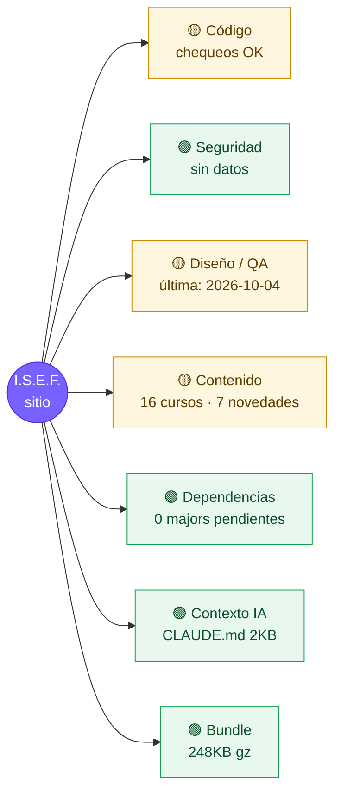

# Mapa de salud del proyecto

> Generado por `npm run health` el 2026-10-04 (commit `5e80907`). No editar a mano.

## Qué hacer ahora
1. **[codigo]** Auditoría de código (347 archivos cambiados desde la última)
2. **[contenido]** 8 alerta(s) de contenido
3. **[diseno]** Auditoría de diseño/QA visual (183 archivos de UI cambiados)

## Detalle
| Área | Estado | Dato |
|---|---|---|
| Tipos / lint | — | omitido (--quick) |
| Contenido | 🟡 | Curso "Enfermedad Cardiovascular" ya empezó y sigue con etiqueta "¡Nuevo!" · Curso "Fuerza muscular" ya empezó y sigue con etiqueta "¡Nuevo!" · Curso "Inteligencia artificial" ya empezó y sigue con etiqueta "¡Nuevo!" |
| Imports (mayúsculas) | 🟢 | OK |
| Vulnerabilidades | — | sin datos (offline o --quick) |
| Dependencias | 🟢 | al día |
| Bundle JS | 🟢 | 248 KB gzip total · react 73KB, index 36KB, AdminPage 32KB |
| Archivos pesados (tokens) | 🟢 | package-lock.json (171KB), content/cv/nelio-bazan.json (79KB), src/features/test-hiit/StroopTest.tsx (34KB) |

## Últimas auditorías
- **codigo**: 2026-10-04 (`aaff98d`)
- **seguridad**: 2026-10-04 (`aaff98d`)
- **diseno**: 2026-10-04 (`aaff98d`)
- **contenido**: 2026-10-04 (`aaff98d`)
- **tokens**: 2026-10-04 (`aaff98d`)
