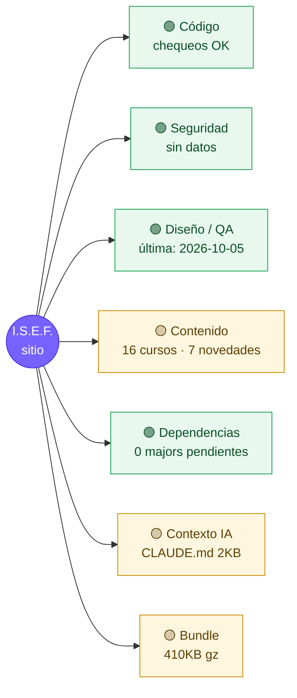

# Mapa de salud del proyecto

> Generado por `npm run health` el 2026-10-05 (commit `7a75235`). No editar a mano.

## Qué hacer ahora
1. **[contenido]** 1 alerta(s) de contenido
2. **[tokens]** Higiene de contexto: revisar CLAUDE.md, archivos pesados y .claude/settings.json

## Detalle
| Área | Estado | Dato |
|---|---|---|
| Tipos / lint | — | omitido (--quick) |
| Contenido | 🟡 | Última novedad: 2025-10-14 (más de 60 días) |
| Imports (mayúsculas) | 🟢 | OK |
| Vulnerabilidades | — | sin datos (offline o --quick) |
| Dependencias | 🟢 | al día |
| Bundle JS | 🟡 | 410 KB gzip total · pdf 139KB, react 83KB, index 39KB |
| Archivos pesados (tokens) | 🟡 | package-lock.json (180KB), content/cv/nelio-bazan.json (79KB), src/features/test-hiit/StroopTest.tsx (34KB), src/admin/Admin.module.scss (32KB) |

## Últimas auditorías
- **codigo**: 2026-10-05 (`7a75235`)
- **seguridad**: 2026-10-04 (`3963eec`)
- **diseno**: 2026-10-05 (`7a75235`)
- **contenido**: 2026-10-04 (`3963eec`)
- **tokens**: 2026-10-04 (`3963eec`)
