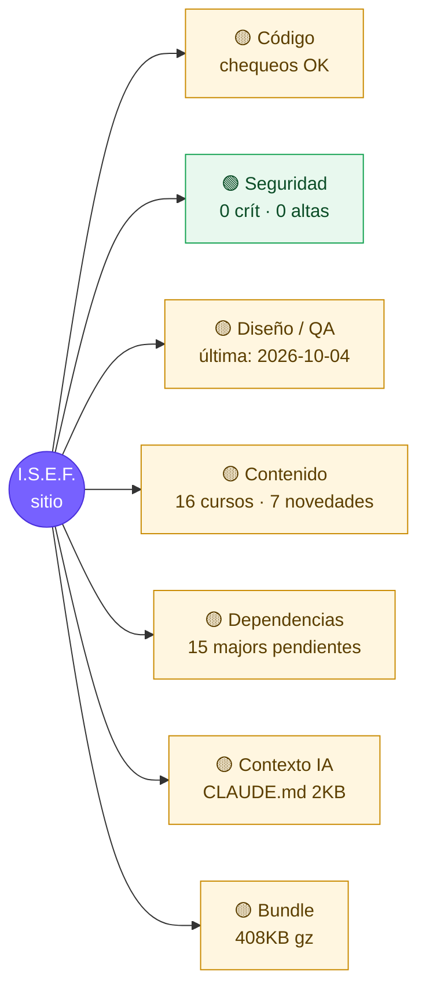

# Mapa de salud del proyecto

> Generado por `npm run health` el 2026-10-05 (commit `33db7bd`). No editar a mano.

## Qué hacer ahora
1. **[codigo]** Auditoría de código (111 archivos cambiados desde la última)
2. **[contenido]** 1 alerta(s) de contenido
3. **[diseno]** Auditoría de diseño/QA visual (75 archivos de UI cambiados)
4. **[tokens]** Higiene de contexto: revisar CLAUDE.md, archivos pesados y .claude/settings.json
5. **[dependencias]** 15 dependencias con versión mayor nueva

## Detalle
| Área | Estado | Dato |
|---|---|---|
| Tipos / lint | 🟢 | tsc OK · eslint OK |
| Contenido | 🟡 | Última novedad: 2025-10-14 (más de 60 días) |
| Imports (mayúsculas) | 🟢 | OK |
| Vulnerabilidades | 🟢 | info: 0, low: 0, moderate: 0, high: 0, critical: 0, total: 0 |
| Dependencias | 🟡 | @eslint/js 9.39.5→10.0.1, @types/node 18.19.130→26.6.4, @types/react 18.3.18→19.3.0, @types/react-dom 18.3.5→19.3.0, @vitejs/plugin-react 4.3.4→6.1.1 |
| Bundle JS | 🟡 | 408 KB gzip total · pdf 139KB, react 83KB, index 39KB |
| Archivos pesados (tokens) | 🟡 | package-lock.json (180KB), content/cv/nelio-bazan.json (79KB), src/features/test-hiit/StroopTest.tsx (34KB), src/admin/Admin.module.scss (33KB) |

## Últimas auditorías
- **codigo**: 2026-10-04 (`3963eec`)
- **seguridad**: 2026-10-04 (`3963eec`)
- **diseno**: 2026-10-04 (`89c2f99`)
- **contenido**: 2026-10-04 (`3963eec`)
- **tokens**: 2026-10-04 (`3963eec`)
